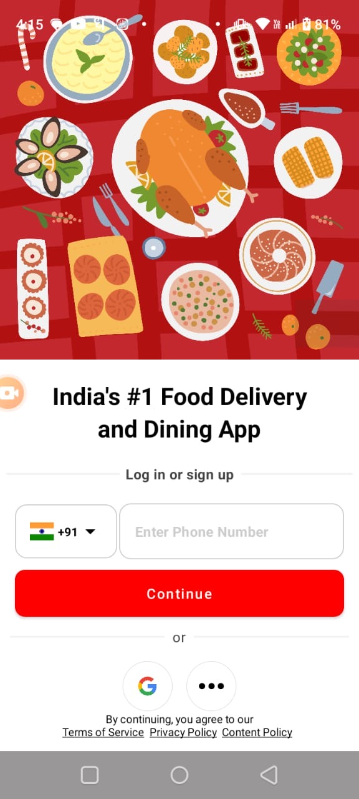
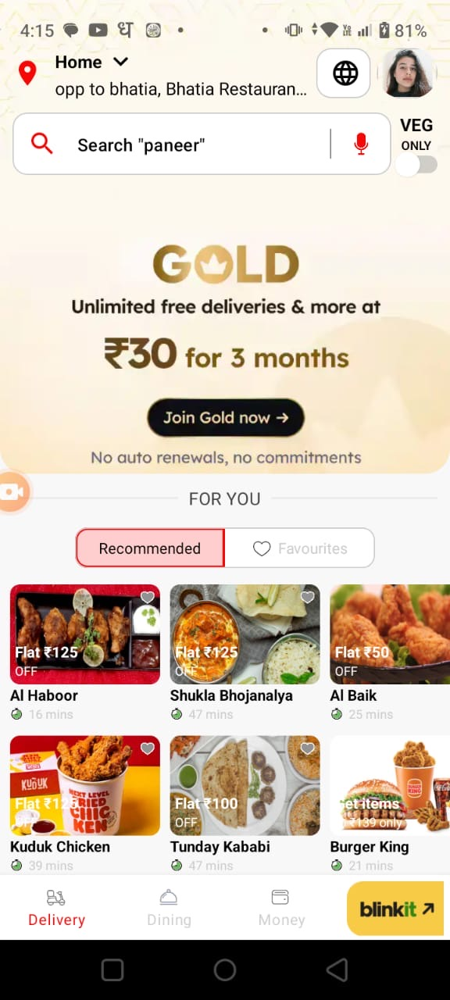
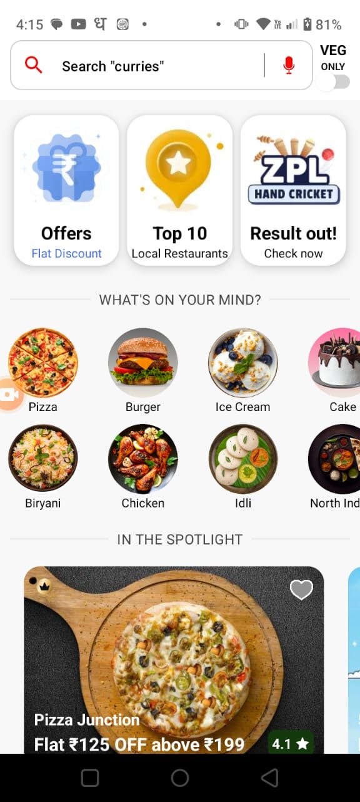
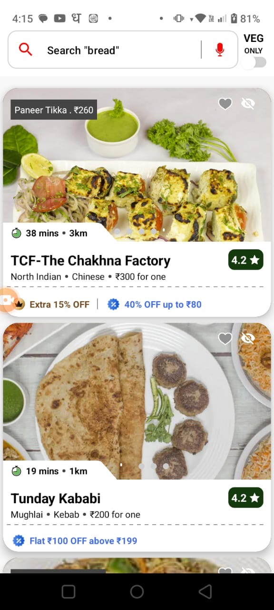
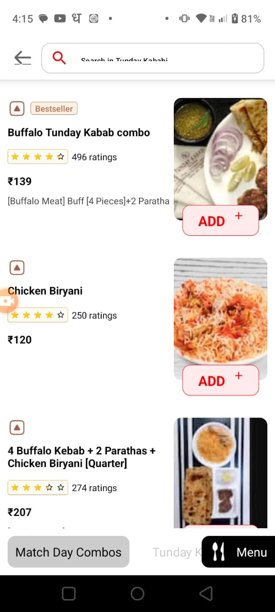

🚀 Excited to share my Zomato clone app built with Jetpack Compose! 🚀

Experience the journey of recreating the renowned Zomato app, known for its exceptional food delivery services. The UI/UX design is captivating, and I've successfully replicated it in this project. Take a look and share your feedback!

This project covers advanced concepts, so beginners, make sure to grasp the basics before diving in. Fork the code from my GitHub repository (https://github.com/kashifansari786/ZomatoCloneCompose) to explore further.

🔍 Project Highlights:

1)Splash screen
2)Login screen
3)Country selection screen
4)Delivery screen
5)Location screen
6)Restaurant screen
7)Dining screen (coming soon)
8)Money screen (coming soon)
9)Profile screen (coming soon)
10)Blinkit screen (coming soon)

💡 Key Learnings:

1)State management
2)Synchronized bottom and top bars when scrolling
3)Nested LazyColumn
4)LazyHorizontalGrid
5)Navigation with NavHost
6)LaunchedEffect usage
7)Scaffold for bottom and top bars
8)Dynamic status bar color changes
10)List animation on scroll (implemented in restaurant screen)
11)Coroutines and Flow usage

##ScreenShots##

